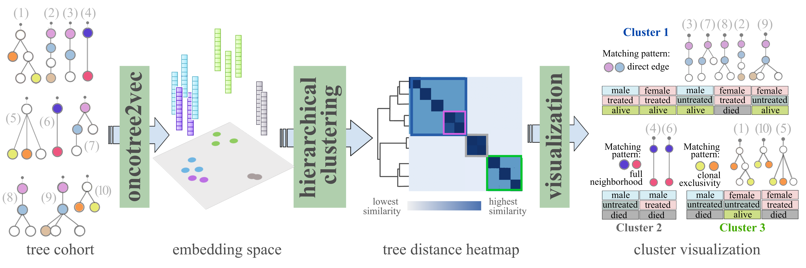

<div align="left">

</div>

[](https://doi.org/10.1093/bioinformatics/btae214)
# oncotree2vec – A method for embedding and clustering of tumor mutation trees


## Abstract

<p align="justify">Understanding the genomic heterogeneity of tumors is an important task in computational oncology, especially in the context of finding personalized treatments based on the genetic profile of each patient’s tumor. Tumor clustering that takes into account the temporal order of genetic events, as represented by tumor mutation trees, is a powerful approach for grouping together patients with genetically and evolutionarily similar tumors and can provide insights into discovering tumor sub-types, for more accurate clinical diagnosis and prognosis.</p>

<p align="justify">We propose <b>oncotree2vec</b>, a method for clustering tumor mutation trees by learning vector representations of mutation trees that capture the different relationships between subclones in an unsupervised manner. Learning low-dimensional tree embeddings facilitates the visualization of relations between trees in large cohorts and can be used for downstream analyses, such as deep learning approaches for single-cell multi-omics data integration.</p>

<div align="center">

</div>

## Requirements

The codebase is implemented in Python (at least version 3.11), with the following dependencies:
```
anytree            2.8.0
numpy              1.23.5  
pandas             2.1.3
tensorflow         2.12.0
matplotlib         3.8.2
seaborn            0.13.0
plotly             5.18.0
umap-learn         0.5.5
networkx           3.2.1
gensim             4.3.2
kaleido-core       0.1.0
```

## Arguments
```
$ cd src; python oncotree2vec.py -h

usage: oncotree2vec [-h] -c CORPUS -e EPOCHS [--wlk_sizes [WLK_SIZES ...]] [-x0 AUGMENT_INDIVIDUAL_NODES]
                    [-x1 AUGMENT_NEIGHBORHOODS] [-x2 AUGMENT_PAIRWISE_RELATIONS] [-x3 AUGMENT_DIRECT_EDGES]
                    [-x4 AUGMENT_MUTUALLY_EXCLUSIVE_RELATIONS] [-x5 AUGMENT_TREE_STRUCTURE]
                    [-x6 AUGMENT_ROOT_CHILD_RELATIONS] [-nlabel GEXF_NODE_ATTRIBUTE_LABEL]
                    [-rlabel ROOT_LABEL] [-ilabel IGNORE_LABEL]
                    [-d EMBEDDING_SIZE] [-neg NUM_NEGSAMPLE] [-lr LEARNING_RATE] [-b BATCH_SIZE]
                    [-threshold HEATMAP_CONTRAST_THRESHOLD] [--remove_unique_words] [--generate_heatmaps] 
                    [-f FILENAME_SAMPLENAME_MAPPING] [-o OUTPUT_DIR] [-s SUFFIX]

* Mandatory arguments:
  -c CORPUS, --corpus CORPUS
                        Path to directory containing tree files in GEXF format to be used for clustering
  -e EPOCHS, --epochs EPOCHS
                        Number of iterations the whole dataset of trees is traversed

* Tree vocabulary related arguments (optional):
  --wlk_sizes [WLK_SIZES ...]
                        Seizes of WL kernel (i.e., degree of rooted subtree features to be considered for
                        representation learning)
  -x0 AUGMENT_INDIVIDUAL_NODES, --augment_individual_nodes AUGMENT_INDIVIDUAL_NODES
                        Number of times to augment the vocabulary for the individual nodes
  -x1 AUGMENT_NEIGHBORHOODS, --augment_neighborhoods AUGMENT_NEIGHBORHOODS
                        Number of times to augment the vocabulary for the tree neighborhoods
  -x2 AUGMENT_PAIRWISE_RELATIONS, --augment_pairwise_relations AUGMENT_PAIRWISE_RELATIONS
                        Number of times to augment the vocabulary for the non-adjacent pairwise relations
  -x3 AUGMENT_DIRECT_EDGES, --augment_direct_edges AUGMENT_DIRECT_EDGES
                        Number of times to augment the vocabulary for the direct edges
  -x4 AUGMENT_MUTUALLY_EXCLUSIVE_RELATIONS, --augment_mutually_exclusive_relations AUGMENT_MUTUALLY_EXCLUSIVE_RELATIONS
                        Number of times to augment the vocabulary for the mutually exclusive relations
  -x5 AUGMENT_TREE_STRUCTURE, --augment_tree_structure AUGMENT_TREE_STRUCTURE
                        Number of times to augment the vocabulary for the tree structure
  -x6 AUGMENT_ROOT_CHILD_RELATIONS, --augment_root_child_relations AUGMENT_ROOT_CHILD_RELATIONS
                        Number of times to augment the vocabulary for the root-child node relations
  -nlabel GEXF_NODE_ATTRIBUTE_LABEL, --gexf_node_attribute_label GEXF_NODE_ATTRIBUTE_LABEL
                        Node attribute label in the GEXF file
  -rlabel ROOT_LABEL, --root_label ROOT_LABEL
                        Label of the neutral node (used for discarding certain node relations)
  -ilabel IGNORE_LABEL, --ignore_label IGNORE_LABEL
                        Label to be ignored when matching individual nodes or pairwise relations (usecase:
                        ignoring neutral clones)
  --remove_unique_words / --no_remove_unique_words
                        Discard from the vocabulary the words which are unique across the entire cohort. This
                        increases the contribution of rare word matches encoded in the embedding.

* ML model related arguments (optional):
  -b BATCH_SIZE, --batch_size BATCH_SIZE
                        Number of samples per training batch
  -d EMBEDDING_SIZE, --embedding_size EMBEDDING_SIZE
                        Intended tree embedding size to be learnt
  -neg NUM_NEGSAMPLE, --num_negsample NUM_NEGSAMPLE
                        Number of negative samples to be used for training
  -lr LEARNING_RATE, --learning_rate LEARNING_RATE
                        Learning rate to optimize the loss function


* Output visualization related aguments (optional):
  -threshold HEATMAP_CONTRAST_THRESHOLD, --heatmap_contrast_threshold HEATMAP_CONTRAST_THRESHOLD
                        Numerical threshold in the range 0 and 1 indicating the cutoff for the hierarhical
                        clustering w.r.t. the maximum cosine distance between the samples inside each cluster
  --generate_heatmaps / --no_generate_heatmaps
                        Generate hierarchically-clustered heatmap of tree similarities based on the learned
                        embeddings after every 100 iterations.


* Other arguments (optional):
  -o OUTPUT_DIR, --output_dir OUTPUT_DIR
                        Path to directory for storing output embeddings

  -f FILENAME_SAMPLENAME_MAPPING, --filename_samplename_mapping FILENAME_SAMPLENAME_MAPPING
                        Path to csv file containing the mapping between the GEXF filenames and the tree sample
                        names.
  -s SUFFIX, --suffix SUFFIX
                        Suffix to be added to the output filenames

```

## Usage examples 

### Datasets used in the oncotree2vec paper (parameteres used as listed in Suppl. Table 2)

**138 Non-small-cell lung cancer mutation trees from Caravagna et al., 2018**<br/>
*(Suppl. Fig. 13 in the oncotree2vec paper)*
```
$ cd src; python oncotree2vec.py --corpus ../data/tracerx_lung --embedding_size 128 --wlk_sizes 0 --augment_tree_structure 0 --augment_neighborhoods 0 --augment_individual_nodes 0 --augment_root_child_relations 1 --augment_direct_edges 1 --augment_pairwise_relations 1 --augment_mutually_exclusive_relations 1 --epochs 1000 --filename_samplename_mapping ../data/tracerx_lung/filename_index.csv
```

**123 AML point mutation trees from Morita et al., 2020**<br/> 
*(Fig. 3 and Suppl. Fig. 11 in the oncotree2vec paper)*
```
$ cd src; python oncotree2vec.py --corpus ../data/aml-mutation-trees/trees_morita_2020 --embedding_size 128 --wlk_sizes 1 2 3 --augment_tree_structure 0 --augment_neighborhoods 1 --augment_individual_nodes 5 --augment_root_child_relations 20 --augment_direct_edges 10 --augment_pairwise_relations 10 --augment_mutually_exclusive_relations 10 --epochs 20000 --filename_samplename_mapping ../data/aml-mutation-trees/trees_morita_2020/filename_index.csv
```

**43 tumor evolution trees from Noble et al., 2022**<br/>
*(Fig. 3 and Suppl. Fig. 9 in the oncotree2vec paper)*
```
$ cd src; python oncotree2vec.py --corpus ../data/modes_of_evolution/trees_noble_2022 --embedding_size 64 --wlk_sizes 1 2 3 --augment_tree_structure 5 --augment_neighborhoods 0 --augment_individual_nodes 0 --augment_root_child_relations 0 --augment_direct_edges 0 --augment_pairwise_relations 0 --augment_mutually_exclusive_relations 0 --epochs 1000 --filename_samplename_mapping ../data/modes_of_evolution/trees_noble_2022/filename_index.csv
```

**Synthetic dataset I (Suppl. Fig. 5)**
```
$ cd src; python oncotree2vec.py --corpus ../data/synthetic_data/1_neighborhood-matching-trees --embedding_size 128 --wlk_sizes 1 2 3 4 5 6 7 8 9 --augment_tree_structure 1 --augment_neighborhoods 1 --augment_individual_nodes 0 --augment_root_child_relations 0 --augment_direct_edges 0 --augment_pairwise_relations 0 --augment_mutually_exclusive_relations 0 --epochs 10000 --filename_samplename_mapping ../data/synthetic_data/1_neighborhood-matching-trees/filename_index.csv
```

**Synthetic dataset II (Suppl. Fig. 6)**
```
$ cd src; python oncotree2vec.py --corpus ../data/synthetic_data/2_matching-vocabulary-sizes --embedding_size 64 --wlk_sizes 0 --augment_tree_structure 0 --augment_neighborhoods 0 --augment_individual_nodes 1 --augment_root_child_relations 0 --augment_direct_edges 0 --augment_pairwise_relations 0 --augment_mutually_exclusive_relations 0 --no_remove_unique_words --epochs 500 --filename_samplename_mapping ../data/synthetic_data/2_matching-vocabulary-sizes/filename_index.csv
```

**Synthetic dataset III (Suppl. Fig. 8)**
```
$ cd src; python oncotree2vec.py --corpus ../data/synthetic_data/3_comparison --embedding_size 32 --wlk_sizes 1 2 3 --augment_tree_structure 0 --augment_neighborhoods 1 --augment_individual_nodes 0 --augment_root_child_relations 5 --augment_direct_edges 5 --augment_pairwise_relations 5 --augment_mutually_exclusive_relations 5 --epochs 1000 --filename_samplename_mapping ../data/synthetic_data/3_comparison/filename_index.csv
```

### Prepare custom input

<p align="justify">Oncotree2vec learns tree embeddings in order to assess the similarity between different mutatin trees, based on the matches between the node labels accross different trees. We use input trees in <a href=https://networkx.org/documentation/stable/reference/readwrite/gexf.html>GEXF</a> format, where the node labels are specified in the <i>"Label"</i> attribute, as shown in the dataset examples from the <a href=https://github.com/cbg-ethz/oncotree2vec/tree/main/data>data</a> directory. The name of the GEXF node label attribute (<i>"Label"</i>, by default) can be changed through the <code>--gexf_node_attribute_label</code> argument. The <i>.gexf</i> file extension is required for the input files. By default, the tree sample names used correspond to the <i>.gexf</i> filenames. The user can provide a different mapping between the <i>.gexf</i> filenames and the tree samples names using the <code>--filename_samplename_mapping</code> argument.</p> 

## Output files

The output files are generated in the `/embeddings` directory. For each run a new directory with a tiestamp prefix is created.

After every 100 iterations the following files are generated:
- \*embeddings.csv (the learned embeddings)
- \*heatmap.png (hierarchically-clustered heatmap of tree similarities based on the learned embeddings)
- \*heatmap_sample_order.csv
- \*oncotreevis.json (results in a JSON format that ca be directly uploaded to the [oncotreeVIS](https://cbg-ethz.github.io/oncotreeVIS) web application to visualize the trees at cohort level grouped by cluster.

In the last iteration additional output files are generated:
- \*vocabulary_sizes.png (heatmap where the pixels reflect the size of the tree vocabulary intersection between each pair of trees)
- \*umap.png (UMAP where each tree is a dot in the latent space, colored by the corresponding cluster;the clusterig is obtained using a cutoff provided through the `--heatmap_contrast_threshold` argument)
- \*clusters.csv (clusterig obtained using a cutoff provided through the `--heatmap_contrast_threshold` argument)
- \*loss_values.png (plot of the residual function for the whole training)
- \*other_scores.png (minimum and maximum cosine distance scores and silhouette score for the clusters obtained using a cutoff set through the `--heatmap_contrast_threshold` argument).

<p align="justify">For large datasets generating the heatmap can take a considerably long time, therefore the user can choose to skip the heatmap generation using the <code>--no_generate_heatmaps argument</code>.</p> 

<p align="justify">The additional plots generated at the end of the training (<i>*loss_values.png</i> and <i>*other_scores.png</i>) can help the user choose the optimal cutoff number of iterations at which the training reaches convergence by tracking the steadiness of the residual function (in <i>loss_values.png</i>) and the minimum and maximum cosine distance between the learned embeddings (a successfull training should learn embeddings that have a good coverage over the embedding space), as well as the silhouette score that indicates the cluser separation using a fixed threshold for the hierarchical clusterig (default threshold is 0.5).</p> 

### Visualize the output tree clusters

<p align="justify">In order to generate a visualization for the output after a certain number of iterations using a different cutoff for the hierarchilcal clustering (default threshold is 0.5) we provide following command:</p>

```
$ cd src; python visualize_embeddings.py --in_embeddings ../embeddings/1743606908_trees_morita_2020/1743606908_iter15000_embeddings.csv --corpus_dir ../data/aml-mutation-trees/trees_morita_2020 --threshold 0.55
```

<p align="justify">This script also generates a JSON file that can be directly uploaded to the <a href=https://cbg-ethz.github.io/oncotreeVIS>oncotreeVIS</a> web application to visualize the trees at cohort level grouped by cluster.</p>

<p align="justify">Please fell free to use your own script to visualize the learned embeddings by directly accessing the <i>*embeddings.csv</i> output file.</p>
